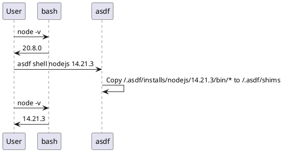

## Plugins

```shell
asdf plugin-add <plugin-name> <optional-repo-url>
```

<https://github.com/asdf-vm/asdf-plugins>


speaker:

Permet l'installation d'un plugin pour gérer les versions d'un outil.

,,,

## .tool-versions

```shell
$ cat .tool-versions
nodejs 14.21.3
```

speaker:

Définit les versions souhaitées d'un ou plusieurs outil(s).

On peut/doit commit ce fichier au même titre que le gitignore

,,,

## Installation d'une version

```shell
asdf install <plugin> <version>
asdf install nodejs 14.21.3
asdf install
```

,,,

## Local vs Global

TODO Fix Me
<span class="img_background" style="--top: 100px; --left: 800px; --width: 400px; --height: 800px; --image: url('/assets/img/illustrations/crop/Devfest_2023_Croquis_Petite_iLLU_indiana_jonas_basic.png')"></span>

<span class="img_background" style="--top: 100px; --left: -100px; --width: 400px; --height: 200px; --image: url('/assets/img/illustrations/crop/Devfest_2023_Croquis_Petite_iLLU_indiana_jonas_basic.png')"></span>

```text
~/
├── slides/
│   ├── assets/
│   │   ├── code/
│   │   │   ├── node14/
│   │   │   │   └── .tool-versions
│   │   │   └── node18/
│   │   │       └── .tool-versions
├── .tool-versions
```

```bash
$ asdf global <outil> <version>
$ asdf local <outil> version>
```

,,,

## Shims

```bash
$ ls ~/.asdf/installs/nodejs/20.8.0/bin -al
lrwxrwxrwx.  corepack -> ../lib/node_modules/corepack/dist/corepack.js
-rwxr-xr-x.  node
lrwxrwxrwx.  npm -> ../lib/node_modules/npm/bin/npm-cli.js
lrwxrwxrwx.  npx -> ../lib/node_modules/npm/bin/npx-cli.js
lrwxrwxrwx.  yarn -> ../lib/node_modules/yarn/bin/yarn.js
lrwxrwxrwx.  yarnpkg -> ../lib/node_modules/yarn/bin/yarn.js

$ ls ~/.asdf/shims/
age                       age-keygen                aws                    go
node                      npm                       direnv                 npx
yarn                      ytt
```



TODO : Schéma ?

https://www.plantuml.com/plantuml/uml/SoWkIImgAStDuGejJYrIqBLJI4eiph1IoCjFILNGBUC2yK2Y85ah1IC3FGiz0xZInEAKD2imgL2SaPgJ0zQLLQnWQA9dPAXdp0MIGQXppY-eLAZJrmFnz3FpW1Rdv1JhGxJeGxNe9sNcwMifbEJ35HPdPEOM4-CukAqEgNafG0y10000

speaker: Le dossier ~/.asdf/shims contient les binaires de la versions actuelles.
Lors d'un changement de .tool-versions / d'outil / de version, asdf fait un reshim des biniaires pour la versions donnée et l'outil donné, ce qui recré les fichiers dans le dossier ~/asdf/shims depuis le dossier ~/.asdf/install/<tool>/<version>/bin/
